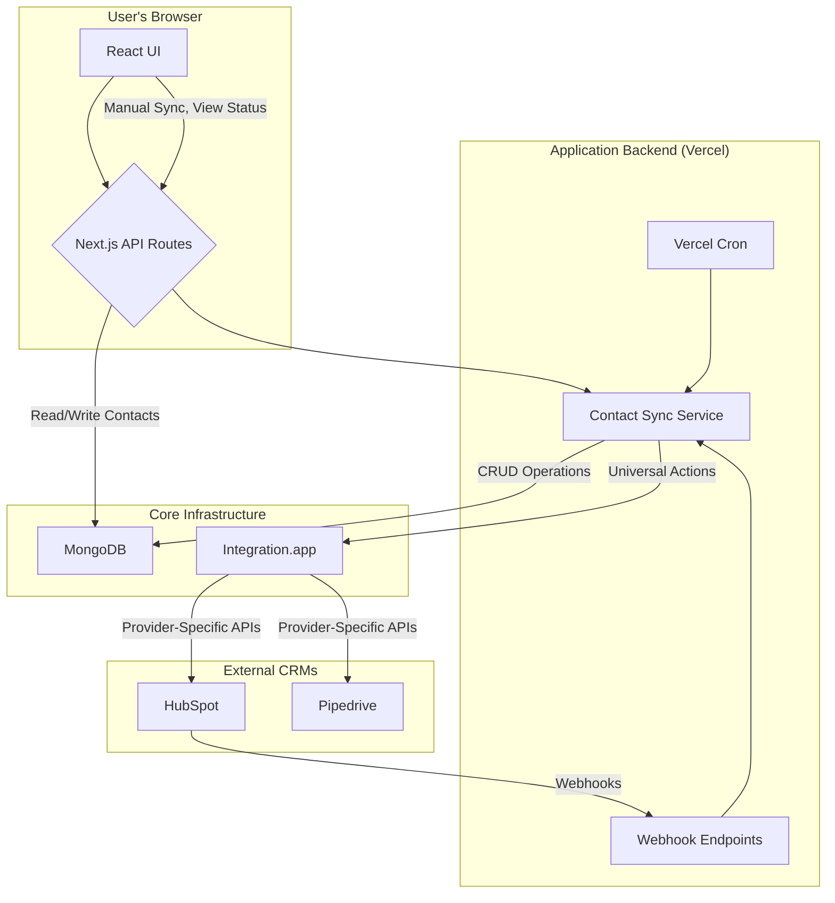

---
mb_meta:
  project: Integration.app Bi-Directional Contact Sync
  version: 1.0.0
  lastUpdated: '2025-07-07T15:47:00Z'
  authors:
    - Cline
---

# System Patterns & Architecture

This document describes the high-level architectural patterns, data flow, and component responsibilities for the bi-directional contact sync application.

## 1. High-Level Architecture

The system is designed around a central **Sync Engine** that communicates with external CRMs via the **Integration.app** platform. The front-end is a Next.js application that provides UI for contact and integration management.

## 2. Data Flow Patterns

### 2.1. Outbound Sync (App → CRM)

1.  **Trigger:** A contact is created or updated in the application UI.
2.  **API Call:** The UI calls a local API endpoint (e.g., `/api/contacts`).
3.  **Sync Service:** The API route invokes the `ContactSyncService`.
4.  **Upsert Operation:** The service uses the Integration.app client to call the universal `upsertContact` action.
5.  **Data Mapping:** Integration.app maps the universal contact model to the provider-specific format (HubSpot contact or Pipedrive person).
6.  **CRM Update:** The mapped data is sent to the respective CRM's API.
7.  **Link Creation:** A `ContactLink` record is created in MongoDB to associate the local contact ID with the new external CRM ID.

### 2.2. Inbound Sync (CRM → App)

#### HubSpot (Webhook-driven)

1.  **Trigger:** A contact is created or updated in HubSpot.
2.  **Webhook Event:** HubSpot sends a webhook to the `/api/integration/webhook/hubspot` endpoint.
3.  **Verification:** The endpoint verifies the HMAC signature of the request.
4.  **Processing:** The webhook payload is passed to the `WebhookProcessor`, which invokes the `ContactSyncService`.
5.  **Conflict Resolution:** The service checks for conflicts ("CRM wins").
6.  **Database Update:** The corresponding contact in the local MongoDB is created or updated. The `ContactLink` table is used to find the correct local contact.

#### Pipedrive (Polling-driven)

1.  **Trigger:** A Vercel Cron job fires on a schedule (e.g., every 10 minutes).
2.  **API Call:** The cron job handler invokes the `ContactSyncService`.
3.  **Fetch Changes:** The service calls the Integration.app `listContacts` action with a `lastModified` filter to fetch only recent changes from Pipedrive.
4.  **Processing & DB Update:** The flow proceeds similarly to the webhook-driven path (steps 5-6 above).

## 3. Key Component Responsibilities

-   **`src/lib/sync/contact-sync-service.ts`**: The core orchestrator. It contains the main business logic for the bi-directional sync, deciding when to fetch, push, and how to handle data.
-   **`src/lib/crm/`**: This directory contains provider-specific logic, such as API client wrappers, field mappers, and webhook verifiers. It abstracts away the differences between HubSpot and Pipedrive.
-   **`src/app/api/`**: These are the Next.js API routes that serve as the entry points for all backend operations, including webhooks, cron jobs, and UI-initiated actions.
-   **`src/models/`**: Defines the MongoDB schemas. The `ContactLink` model is the cornerstone of the sync mechanism, acting as the mapping table.
-   **`integration-app/`**: Contains the declarative YAML configuration for Integration.app, defining the universal `ContactsSync` interface and the provider-specific templates.

## 4. Error Handling & Resilience Pattern

-   **Retries:** API calls to CRMs will be wrapped with a basic retry mechanism (e.g., 3 attempts) to handle transient network issues.
-   **Rate Limiting:** A `p-queue` based rate limiter will be used to ensure the application does not exceed the API rate limits of the connected CRMs.
-   **Graceful Degradation:** If a sync operation fails, the error will be logged in the `SyncLog` collection, and the `syncStatus` in the `ContactLink` model will be updated to 'error'. The UI will reflect this status, but the application will remain operational.
-   **Fallback:** Polling acts as a fallback mechanism for webhook failures or for CRMs that do not support webhooks (like Pipedrive in this MVP).
